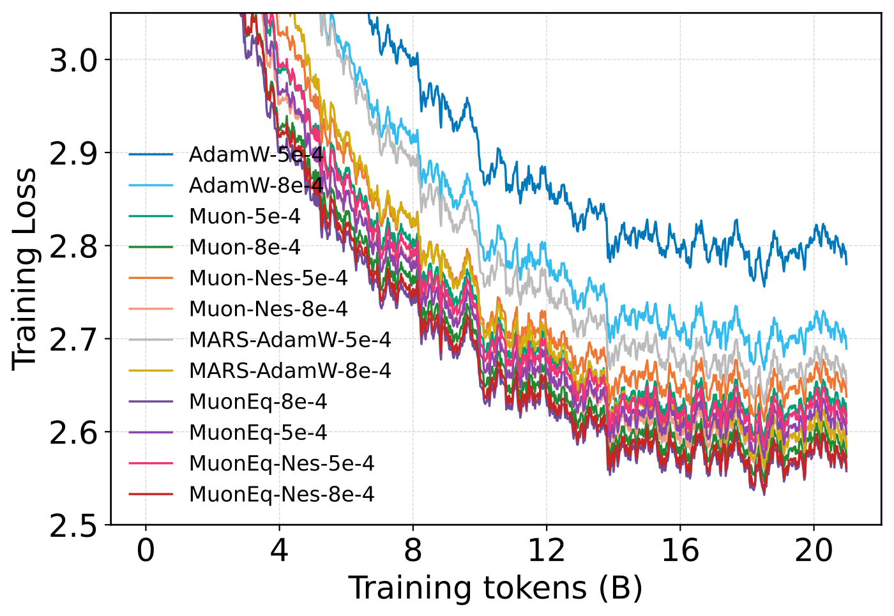
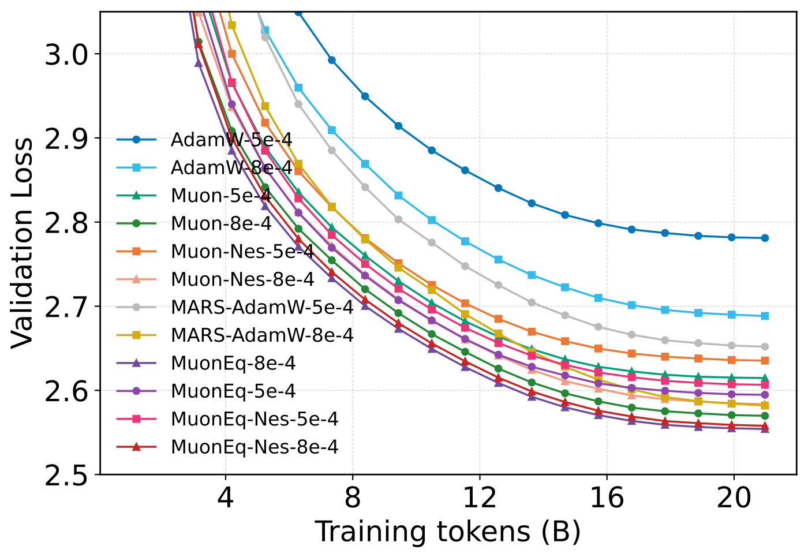
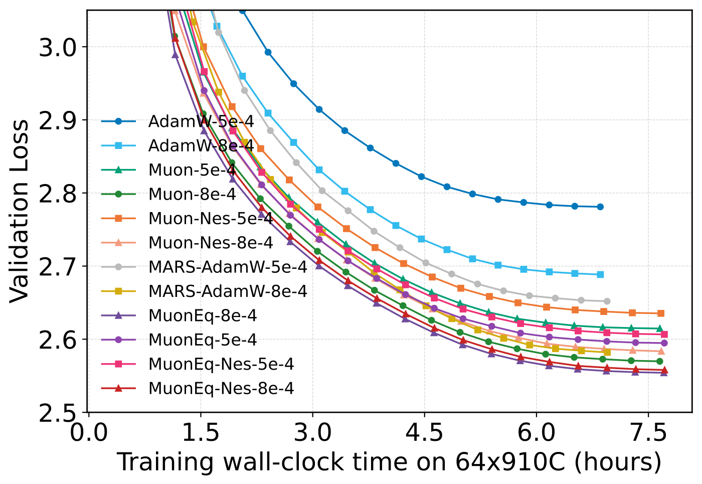

[English](README.md) | [简体中文](README_ZH.md)

# MuonEq: Balancing Before Orthogonalization with Lightweight Equilibration

本仓库配套论文 **MuonEq: Balancing Before Orthogonalization with Lightweight Equilibration**（[arXiv:2603.28254](https://arxiv.org/abs/2603.28254)），收录了 `MuonEq` 在 GPU 与 Ascend NPU 两条实验线上的实现、训练脚本和复现实验入口。

仓库目前主要包含三部分：

- `llm-opt-baseline-gpu/cifar10`：用 CIFAR-10 快速比较不同优化器的行为
- `llm-opt-baseline-gpu/llm-baselines`：GPU 上的 Transformer / LLM baseline 与 `MuonEq` 对比
- `llm-opt-baseline-npu/llama2_pretrain`：Ascend NPU 上的预训练实验

这不是一套从零设计的新训练框架。`llm-opt-baseline-gpu/llm-baselines` 和 `llm-opt-baseline-npu/llama2_pretrain` 都是在公开代码基础上继续修改得到的实验目录；这里保留了它们原本的大体结构，目的是减少迁移成本，方便按原始实验路径复现和继续扩展。

## 目录

- [简介](#简介)
- [仓库结构](#仓库结构)
- [快速开始](#快速开始)
- [直接使用 MuonEq](#直接使用-muoneq)
- [实验结果](#实验结果)
- [环境与依赖](#环境与依赖)
- [许可证](#许可证)
- [引用](#引用)

## 简介

`MuonEq` 在 `Muon` 的正交化之前加入了一步轻量的 equilibration / normalization 处理，用来改善更新矩阵在进入 zeropower / Newton-Schulz 迭代前的数值状态。这个仓库对应的是论文中的实验代码，而不是统一封装后的单一训练框架。

如果你只想先判断应该从哪里开始，可以按下面的方式选入口：

| 目标 | 推荐入口 | 说明 |
| --- | --- | --- |
| 先跑一个最小实验 | `llm-opt-baseline-gpu/cifar10` | 单机即可，适合先确认 `MuonEq` 的行为和命令用法 |
| 在 GPU 上跑 LLM baseline | `llm-opt-baseline-gpu/llm-baselines` | 包含 `MuonEq` 及相关优化器对比 |
| 在 Ascend NPU 上复现预训练实验 | `llm-opt-baseline-npu/llama2_pretrain` | 包含多机场景下的脚本和参数约定 |

## 仓库结构

```text
llm-opt-baseline-gpu/
  cifar10/
  llm-baselines/

llm-opt-baseline-npu/
  llama2_pretrain/
```

## 快速开始

### 1. CIFAR-10

如果你只是想先快速确认 `MuonEq` 的训练行为，最直接的入口是 CIFAR-10：

```bash
cd llm-opt-baseline-gpu
python cifar10/compare_resnet_optimizers.py --epochs 1 --num-runs 1 --num-workers 0
```

这一支里，`Muon` 的 learning-rate scaling 沿用的是 Keller Jordan 在 [`cifar10-airbench`](https://github.com/KellerJordan/cifar10-airbench) 中的做法。

更多命令和参数说明见 [llm-opt-baseline-gpu/cifar10/README.md](llm-opt-baseline-gpu/cifar10/README.md)。

### 2. GPU LLM Baselines

`llm-opt-baseline-gpu/llm-baselines` 用来跑 GPU 上的 Transformer / LLM baseline，对比对象包括 `MuonEq` 及其相关变体。

这一支里，`Muon` 的 learning-rate scaling 采用的是 MoonshotAI [`Moonlight`](https://github.com/MoonshotAI/Moonlight) 中使用的 RMS 对齐做法。

安装依赖：

```bash
cd llm-opt-baseline-gpu/llm-baselines
pip install -r requirements.txt
```

跑一个基础训练：

```bash
python ./src/main.py --config_format base
```

`MuonEq` 相关的 sweep 脚本说明见 [llm-opt-baseline-gpu/llm-baselines/scripts/optimizers_compare/readme.md](llm-opt-baseline-gpu/llm-baselines/scripts/optimizers_compare/readme.md)。

### 3. NPU 预训练

`llm-opt-baseline-npu/llama2_pretrain` 用来跑 Ascend NPU 上的预训练实验。论文主线使用的是 `cosine` 调度；对应脚本同时也保留了 `wsd` 支持，方便继续做扩展实验。

安装依赖：

```bash
cd llm-opt-baseline-npu/llama2_pretrain
pip install -r requirements.txt
```

运行前至少需要设置：

- `C4_DATA_DIR`
- `TOKENIZER_PATH`
- 多节点时通过 `--nodes` 或 `MULTI_NODE_HOSTS` 指定节点地址
- 如果你在 `--nodes` 里传的是简写节点号而不是完整 IP，还需要把 `MULTI_NODE_HOST_PREFIX` 或 `--host-prefix` 改成你自己的网段；脚本默认前缀是 `10.0.0.`

`2026compare` 的实验脚本入口在 `llm-opt-baseline-npu/llama2_pretrain/experiments/2026compare/` 下，主要通过 `multi_node_sweep_*.sh` 和 `multi_node_main_*.sh` 使用。一个最小示例如下：

```bash
cd llm-opt-baseline-npu/llama2_pretrain/experiments/2026compare
C4_DATA_DIR=/path/to/c4 \
TOKENIZER_PATH=t5-base \
VISIBLE_NPUS=0,1,2,3,4,5,6,7 \
NUM_NPUS_PER_JOB=8 \
bash multi_node_sweep_350m.sh --nodes 10.0.1.131,10.0.1.132 adamw
```

更详细的多节点参数说明见 [llm-opt-baseline-npu/llama2_pretrain/experiments/2026compare/multi_node_usage.md](llm-opt-baseline-npu/llama2_pretrain/experiments/2026compare/multi_node_usage.md)。

## 直接使用 MuonEq

如果你想直接在自己的代码里调用 `MuonEq`，两个实现位置分别是：

- NPU: `llm-opt-baseline-npu/llama2_pretrain/optimizers/muon_variants/muoneq.py`
- GPU: `llm-opt-baseline-gpu/llm-baselines/src/optim/muoneq.py`

两边的类名都叫 `MuonEq`，核心调用方式保持一致，区别主要是导入路径：

```python
# NPU
from optimizers.muon_variants.muoneq import MuonEq

# GPU
from optim.muoneq import MuonEq

optimizer = MuonEq(
    lr=1e-3,
    wd=0.1,
    muon_params=muon_params,
    adamw_params=adamw_params,
    momentum=0.95,
    nesterov=True,
    ns_steps=5,
    adamw_betas=(0.95, 0.95),
    normalize_mode="row",   # also supports "rowcol" and "col"
    phase=None,             # can switch from row/col to row after phase
    zeropower_mode="native" # or "spc"
)
```

如果你想直接复用这个仓库里的预训练脚本，也可以调用：

- `llm-opt-baseline-npu/llama2_pretrain/scripts/pretrain_c4_dist.py`

对应的 optimizer 名称是：

- `muoneq-row`
- `muoneq-rowcol`
- `muoneq-col`

## 实验结果

`LLaMA2-1B` 训练到 `21B tokens` 的部分结果如下：

| Train Loss vs Tokens | Val Loss vs Tokens | Val Loss vs Train Time |
| --- | --- | --- |
|  |  |  |

## 环境与依赖

GPU baseline 和 NPU pretrain 分别维护自己的依赖：

- `llm-opt-baseline-gpu/llm-baselines/requirements.txt`
- `llm-opt-baseline-npu/llama2_pretrain/requirements.txt`

更稳妥的做法是给这两部分分别建环境，不要强行共用一套依赖。

## 许可证

根目录代码按 MIT 协议发布，见 `LICENSE`。

仓库中保留的第三方实验目录继续保留它们各自的许可证文件：

- `llm-opt-baseline-gpu/llm-baselines/LICENSE`
- `llm-opt-baseline-npu/llama2_pretrain/LICENSE`

## 引用

如果这份代码或论文对你的工作有帮助，欢迎引用：

```bibtex
@article{chang2026muoneq,
  title={MuonEq: Balancing Before Orthogonalization with Lightweight Equilibration},
  author={Chang, Da and Shi, Qiankun and Zhang, Lvgang and Li, Yu and Zhang, Ruijie and Lu, Yao and Liu, Yongxiang and Yuan, Ganzhao},
  journal={arXiv preprint arXiv:2603.28254},
  year={2026}
}
```
